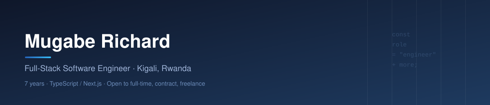

  

Software Engineer &nbsp;||&nbsp; Digital Marketer &nbsp;||&nbsp; Project Manager &nbsp;||&nbsp; IT Support Specialist &nbsp;||&nbsp; Budding Entrepreneur

  
  
  

  
  
  
  
  
  
  

7 years building and shipping production software. Client work, company work, and my own products. A lot of it is private or under NDA, so the three below are public examples, not the full list.

I build the product, run the project, get it in front of users, and keep the servers up.

Open to full-time, contract, and freelance work. Engineering is the main offer. The other skills come with it when a team needs them. Based in Kigali. Remote or open to relocation.

## Public examples

Most engagements stay private. These three are public enough to show how I work.

<table>
<tr>
<td width="33%" valign="top">

**Cham Business**
*CTO, since 2023*

Loan origination and servicing for a licensed lender in Rwanda. Central bank lending rules are enforced in the system, not only written in a policy doc.

`Next.js` `TypeScript` `MySQL`

[→ github.com/mugabee/cham-business](https://github.com/mugabee/cham-business)

</td>
<td width="33%" valign="top">

**Uzuza**
*Co-founder and CTO*

Digital ibimina and cross-border group savings. Next.js, Supabase, MTN MoMo.

`Next.js` `Supabase` `MTN MoMo`

[→ github.com/mugabee/uzuza](https://github.com/mugabee/uzuza)

</td>
<td width="33%" valign="top">

**light_MoneyTransfer**
*Founder and CTO*

Live FX rates and WhatsApp quotes. Node, Express, Postgres.

`Node.js` `Express` `Postgres`

[→ github.com/mugabee/light_MoneyTransfer](https://github.com/mugabee/light_MoneyTransfer)

</td>
</tr>
</table>

Other work covers lending ops, business sites, hosting, and internal tools for teams that cannot put the repo on GitHub.

## Skills around the code

| Role | What it covers |
|---|---|
| **💻 Software Engineer** | TypeScript, JavaScript, SQL, Next.js, React, Node/Express, PostgreSQL, MySQL, Supabase. Production on Vercel, Render, and cPanel / LiteSpeed / Passenger |
| **📈 Digital Marketer** | SEO, Meta Ads, Google Ads, social, email (Mailchimp). Used on Cham, light_MoneyTransfer, and client work to get products in front of real users without a separate marketing hire |
| **📋 Project Manager** | Agile/Scrum, Jira. Turning a client's goal into a scoped build, run myself end to end |
| **🛠️ IT Support Specialist** | Helpdesk, networking, Linux/cPanel, production hosting. I administer the servers I ship to, including Cham and kstorez |
| **🚀 Entrepreneur** | Founder or co-founder/CTO on the public examples above, and on other ventures that stay off GitHub |

## Contact

  <a href="mailto:mugabe.richard.37@gmail.com">mugabe.richard.37@gmail.com</a> &nbsp;·&nbsp;
  <a href="https://www.linkedin.com/in/mugabe-richard/">LinkedIn</a> &nbsp;·&nbsp;
  <a href="https://mugaberichard.com">mugaberichard.com</a> &nbsp;·&nbsp;
  <a href="https://twitter.com/Mugabe_Richard_">@Mugabe_Richard_</a>

In pursuit of success & happiness.

